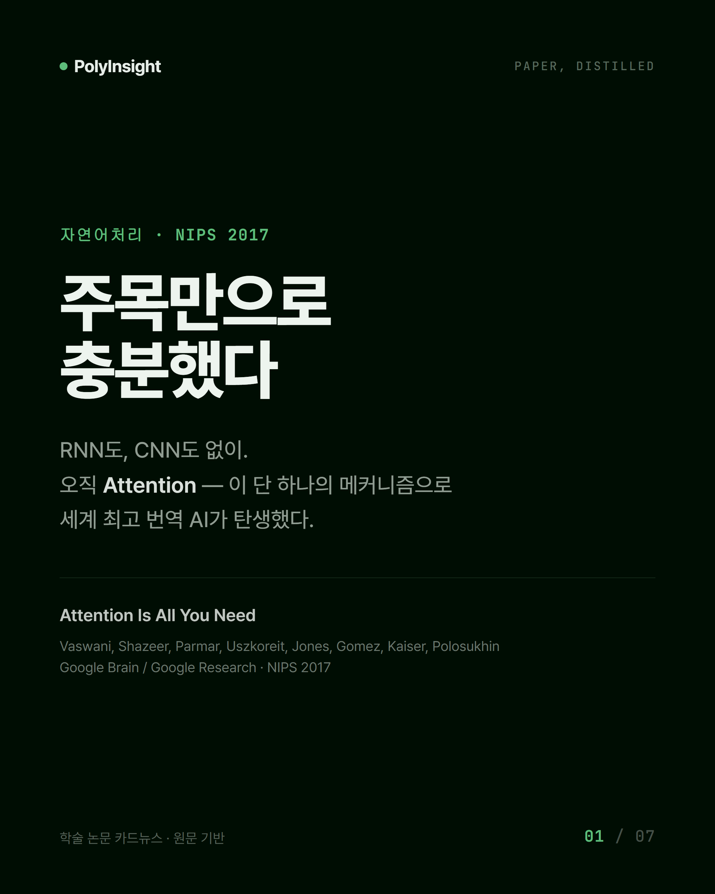
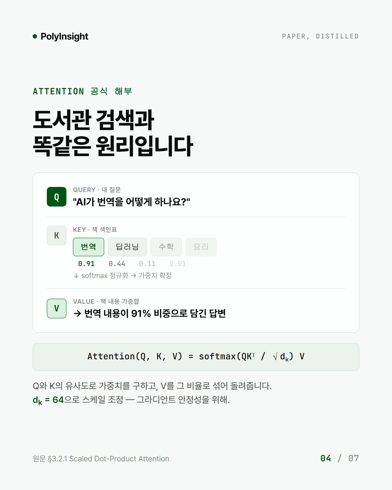
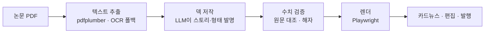
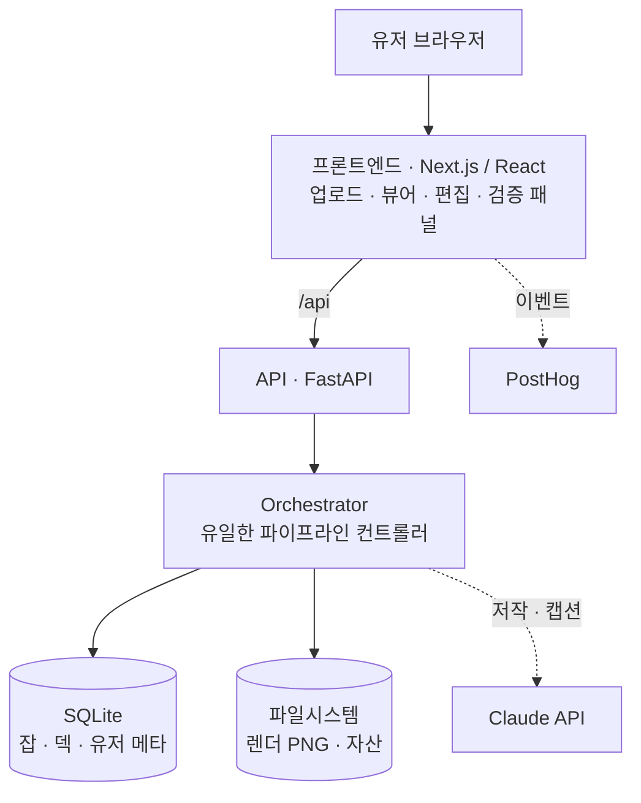
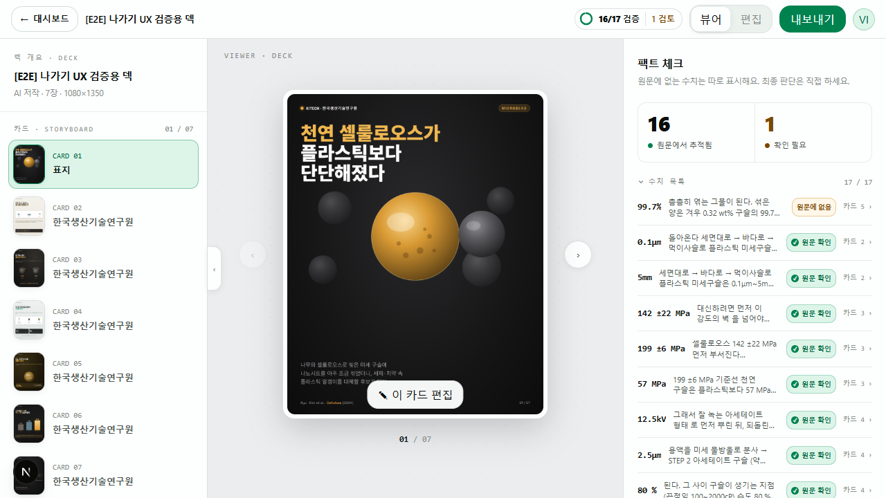

# PaperSweep

> **논문 PDF 한 편을 원문 검증된 카드뉴스로 바꾸는 AI 서비스**

[🔗 라이브](https://polyinsight.japaneast.cloudapp.azure.com)

---

## 문제 — 좋은 연구가, 아무도 모르게 묻힌다

연구자는 뛰어난 연구와 성과물을 가졌다. 하지만 그걸 세상에 알릴 시간도, 마케팅 능력도, 비용도 없다. 본업은 연구니까.

그런데 우수 인재를 영입하고 협력 과제를 수주하려면 — 바로 그 "알림"이 필요하다. 보이지 않는 연구실엔 학생도, 파트너도, 예산도 오지 않는다.

기존 요약 도구는 이 간극을 못 메운다. 빠르게 요약해주지만 **"지어내지 않았다"는 보증이 없다.** 연구자가 자기 이름 걸고 내보내는 콘텐츠에 왜곡이 섞이면, 그건 홍보가 아니라 리스크다.

PaperSweep는 논문 한 편만 넣으면 **원문에 충실한 대중용 카드뉴스**를 만든다. 딥하진 않지만 핵심 인사이트는 살아 있고, 모든 수치는 원문에 근거가 있다.

> *시작은 개인적이었다. 한국생산기술연구원(KITECH)에서 근로장학생으로 일하다 한 연구실의 의뢰를 받았다 — 좋은 연구를 해내고도 그걸 세상에 알릴 방법이 없다는 그 연구실의 실제 고민이, 이 프로젝트의 출발점이다.*

> *시작은 개인적이었다. 한국생산기술연구원(KITECH)에서 근로장학생으로 일하다 한 연구실의 의뢰를 받았다 — 좋은 연구를 해내고도 그걸 세상에 알릴 방법이 없다는 그 연구실의 실제 고민이, 이 프로젝트의 출발점이다.*

---

## 이런 걸 만든다

  
  &nbsp;
  

*"Attention Is All You Need" 논문 한 편 → 대중이 스크롤하다 멈추는 카드뉴스. 오른쪽처럼 **형태 자체가 내용인 카드**(도서관 검색 비유로 Q·K·V를 시각화)까지 AI가 저작한다.*

---

## 기존 도구와 뭐가 다른가

우리 잡(job)은 논문을 *읽는* 게 아니라 *알리는* 것 — 그래서 경쟁 상대는 마케팅 도구다.

| | Mirra | 직접 디자인 (캔바·미리캔버스) | 마케팅 AI (marketingstudios) | **PaperSweep** |
|---|---|---|---|---|
| 대상 | 범용 | 범용 | 마케팅 일반 | **연구자 (학술 특화)** |
| 입력 → 카드 | AI 저작 | **유저가 다 함** | AI (이미지 생성) | **논문 특화 AI 저작** |
| 원문 검증 | 없음 | 유저 책임 | 유저에 전가 | **코드 게이트 검증** |
| 편집 | — | 수동 | 전체 재생성 | 무손실 |

정직하게: **우리도 생성한다.** 차이는 "안 지어낸다"가 아니라, 생성된 수치를 **코드 게이트가 원문과 한 번 더 대조**하고, 통과 못 한 건 "확인 필요"로 표면화한다는 것이다.

---

## 저작 역전 — 이해하는 자가 표현해야 한다

**논문을 이해한 마음이 형태도 발명한다.** 이해와 표현을 가르면 카드의 영혼이 죽는다. (레이아웃을 30개 카탈로그에서 *고르게* 했더니 카드가 밋밋해졌고, 백지 프롬프트로 AI가 *통째로 저작*하게 했더니 우리 파이프라인을 이겼다.)

코드는 창작을 가두는 대신, 창작이 못 하는 걸 한다 — 검증.

- **창작은 AI가** — 한 마음이 이해·형태·표현을 동시에 저작
- **검증은 코드가** — 생성된 수치를 원문과 대조 *(여기가 해자다)*
- **판단은 사람이** — 연구자가 검토하고, 고치고, 승인

---

## 어떻게 동작하나

당연하지 않은 결정 셋:
- **한 번에 저작** — 저작을 나누면 중간 스키마가 필요하고, 그 스키마가 형태를 가둔다. 한 마음이 통째로 저작해야 새 형태를 발명할 수 있다.
- **Playwright 렌더 (이미지 생성 아님)** — 모델이 HTML/CSS로 저작하고 진짜 브라우저가 그린다. 텍스트가 픽셀이 아니라 DOM이라 **100% 정확 + 편집 가능 + 검증 가능.**
- **검증을 별도 단계로** — 자유 저작 + 코드 사후 검증.

---

## 시스템 아키텍처

**Orchestrator가 심장** — 에이전트끼리 직접 호출하지 않고 전부 여기 경유한다(각 단계 validated in → typed out). 저장은 둘로 갈린다: 가벼운 메타는 SQLite, 무거운 PNG·자산은 파일시스템.

**배포** — Azure VM · Docker Compose(web · backend · caddy 자동 HTTPS) · GitHub Actions로 `main` push 시 테스트 통과하면 자동 배포(백업 → 재빌드 → 스모크).

---

## 검증이 왜 어렵나 — 이게 해자다

`238 MPa`가 원문에 있는지 확인하는 건 단순 문자열 검색이 아니다:

| 원문 | 카드 | 문자열 대조 | 실제 |
|---|---|---|---|
| `0.238 GPa` | `238 MPa` | ❌ 미확인 | ✅ 같은 값 (단위 환산) |
| `238.4` | `238` | ❌ 미확인 | ✅ 같은 값 (반올림) |
| `142 ±22 MPa` | `142` | ❌ 미확인 | ✅ 근거 있음 (오차 표기) |

문자열 대조로는 전부 오탐이 난다. 그래서 **추출 → SI 정규화 → 차원 비교** 3층으로 다시 설계했다.

  

*16개 수치를 원문과 대조해 추적하고, 근거 못 찾은 1개(`99.7%`)를 "확인 필요"로 표면화한다. 최종 판단은 사용자.*

> 정직한 한계: 검증은 **수치**를 잡지 **주장**을 못 잡는다. 인과를 뒤집거나 맥락을 들어내는 왜곡은 코드 밖이다.

---

## 스택

`FastAPI` · `Next.js 16` · `React 19` · `Claude API` · `Playwright` · `SQLite` · `Docker` · `Azure`

추출 이중화(pdfplumber·PyMuPDF) + 스캔본 OCR 폴백 · 자체 검증 엔진(순수 Python) · GitHub Actions CI/CD(main push 자동 배포).

---

## 배운 것 — 더 많은 예시가 아니라, 스스로 돌아보게

처음엔 직관대로 갔다: 좋은 디자인을 뽑으려면 좋은 레퍼런스를 잔뜩 먹이면 된다. 그래서 레퍼런스를 많이 준비해 모델에 넣었다.

틀렸다. 레퍼런스를 많이 줄수록 모델은 그것들을 베껴 **같은 디자인만** 내뱉었다. 예시가 학습이 아니라 **구속**이 됐다.

진짜 레버는 다른 데 있었다. 실제 디자인 생성 AI들의 워크플로를 뜯어보니, 하나같이 **자기가 만든 걸 다시 보는 루프**를 갖고 있었다. 품질은 *더 많은 예시*가 아니라 *스스로 돌아보고 고르는 과정*에서 나온다.

**창작하는 AI에게 필요한 건 모방할 견본이 아니라, 자기 작업을 비평할 눈이다.**

---

🚧 만드는 중 · 개인 학습·성장 기록으로 공개한 레포입니다.
