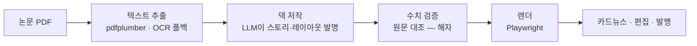

# PolyInsight

> **논문 PDF 한 편을 원문 검증된 카드뉴스로 바꾸는 AI 서비스**

[🔗 라이브](https://polyinsight.japaneast.cloudapp.azure.com)

연구는 대중에게 잘 닿지 않는다. 요약 도구는 많지만, *"지어내지 않았다"* 는 보증이 없다.
PolyInsight는 논문의 모든 수치를 **원문과 대조 검증**한 뒤 카드뉴스로 만든다. 화면에 나가는 숫자는 전부 원문에 근거가 있다.

---

## 어떻게 동작하나

- **텍스트 추출** — 일반 PDF는 pdfplumber, 스캔본은 OCR로 폴백.
- **덱 저작** — 강한 LLM이 논문을 읽고 카드의 스토리·형태·표현을 한 번에 만든다. 코드가 레이아웃을 미리 규정하지 않는다.
- **수치 검증 (핵심)** — 저작된 카드의 모든 숫자를 원문과 대조한다. 단위 환산·반올림·차원까지 맞춰 비교하고, 근거를 못 찾은 수치는 사용자에게 표면화한다. **이게 이 프로젝트의 존재 이유다.**
- **렌더·편집** — 검증된 구조를 이미지로 렌더하고, 사용자가 화면에서 직접 고친다.

## 검증이 왜 어렵나

`238 MPa`가 원문에 있는지 확인하는 건 단순 문자열 검색이 아니다:

| 원문 | 카드 | 문자열 대조 | 실제 |
|---|---|---|---|
| `0.238 GPa` | `238 MPa` | ❌ 미확인 | ✅ 같은 값(단위 환산) |
| `238.4` | `238` | ❌ 미확인 | ✅ 같은 값(반올림) |
| `142 ±22 MPa` | `142` | ❌ 미확인 | ✅ 근거 있음(오차 표기) |

문자열 대조로는 전부 오탐이 난다. 그래서 **추출 → SI 정규화 → 차원 비교** 3층으로 다시 설계했다.

## 스택

`FastAPI` · `Next.js` · `React` · `Claude API` · `Playwright` · `SQLite` · `Docker` · `Azure`

## 상태

🚧 **만드는 중.** 라이브로 돌아가고, 논문 업로드 → 검증 카드뉴스까지 동작한다.

개인 학습·성장 기록으로 공개한 레포입니다.
